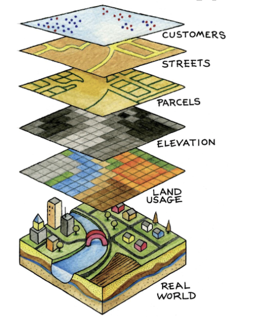

# GIS Basics

## What is GIS?

A geographic information system (GIS) is a platform used to capture, store, analyze, manage, and display various forms of geographically referenced information. GIS is used in dozens of disciplines, ranging from ecology to literary studies to economics, and can also be useful in applied policy and data-based advocacy settings.

## What is GIS used for?

GIS allows us to (among other things):

  * Combine disparate layers of geospatial information to explore and highlight interesting and relevant    connections and relationships
  * Analyze geospatial information (i.e. calculate distances, find intersections between different data, compute spatial statistics etc.)
  * Make digital maps and visualize variables (such as crime prevalence, election results, Census data) in a spatial context
  
## What are GIS data types?

```{r, echo=F, fig.cap="GIS Layers" }

```

There are two main GIS data types used to represent real-world spatial relationships: vector data and raster data. 

The building blocks of vector data are georeferenced points, which can also be combined to form lines and polygons. In the picture above, customers (points), streets (lines), and parcels (polygons) are examples of vector data.  

Raster data consists of georeferenced grid-cells (pixels) that contain data of interest (such as temperature). In the picture above, elevation and land usage are represented using raster data. 

Vector data and raster data can be encoded in a variety of different file formats. In the tutorial below, which only uses vector-based polygon data (to represent states), our polygon layer is stored as a shapefile. A shapefile is one of the most popular file formats used to store geospatial vector data. A shapefile actually consists of multiple files; these files work together to allow GIS software to render geographic information. The main files comprising a shapefile are:

1. .shp: This file contains the geometry data, such as points, lines, or polygons, representing geographic features like roads, rivers, boundaries, or other spatial objects.
2. .shx: The shape index file stores the index data, which helps in quickly accessing the records within the .shp file.
3. .dbf: The database file contains attribute data associated with the geographic features. It stores information like names, IDs, population figures, or any other attribute data related to the spatial objects.
4. prj: This file stores the projection information, which defines how the geographic data is mapped onto a two-dimensional plane. It includes details about coordinate systems, map projections, and other spatial reference information.

Note that when you load a shapefile into QGIS, you will only have to explicitly load in the .shp file; the other parts of the shapefile will load automatically in the background. This will make more sense once you complete the tutorial below. 

## Finding GIS Data

A good starting place for finding GIS data (both vector and raster), is this [guide to geospatial data discovery](https://libguides.colorado.edu/geospatialdata) published by Phil White, CU Boulder's geospatial librarian. This to geospatial data sources published by [Dartmouth](https://researchguides.dartmouth.edu/gisdata/usdata), contains additional resources. 


